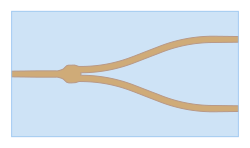

Creating Circuits
-----------------

``Circuit`` class in palgds is used for creating automated layouts of complex photonic circuits.
The designer provides the individidual components and the links between their ports. The optical or 
electrical routes automatically generated in ``Circuit`` class. 

Circuit Layout 1: Basics
***************************

In this section we will create a simple circuit with a ring resonator and grating couplers. For this, we will use the same ring
resonator PCell definition that we used in previous section.

.. code-block:: python
    
    import gdstk
    import numpy as np
    import palgds.base_cells as bc
    from palgds.circuit import Circuit

    ring_res = RingResonator(name="RingRes", radius=10, gap=0.2, width=0.45)

We will grating coupler PCell by reading an existing  GDS file. Make sure you download and put "Grating_Coupler.gds" 
file into your working directory. Here, we are manually providing the port of the grating coupler.

.. code-block:: python

    gc = bc.GDSCell(name="Grating_Coupler", filename='Grating_Coupler.gds',
                    ports={"in": bc.Port((1, 0), 0, "op")})

Now, we will create the circuit using these components. Here, ``pcells`` is the dict of cells that compose the circuit. ``translation`` (default: ``(0, 0)``) and
``rotation`` (default: ``0`` in radians) are transformations of individual components. Connections between ports are provided
with ``links``.

.. literalinclude:: _tutorial/example1.py
    :start-at: circuit = Circuit(name='RingResCircuit',
    :end-before: # end of circuit

Circuit Layout 2: Advanced
************************************

Let's create a Mach-Zehnder interferometer circuit. We will read a custom made Y-Branch with ``GDSCell``. 
First, make sure you download and put "YBranch.gds" and "YBranch.txt" files into your working directory. Then
create the Y-Branch object:

.. code-block:: python

    ybranch = bc.GDSCell(name="YBranch", filename='YBranch.gds', ports_filename="YBranch.txt")

