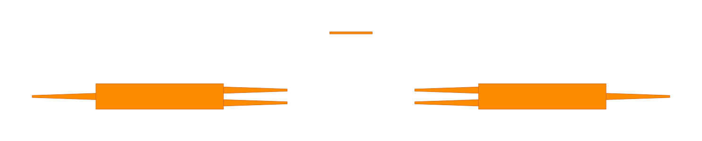
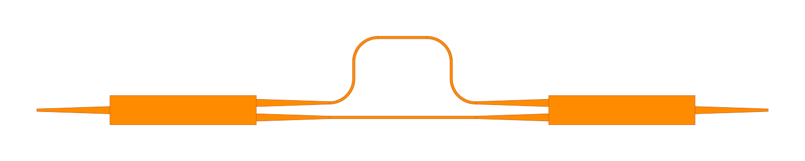

Circuits
----------

``Circuit`` class in ``palgds`` is used for creating automated layouts of complex photonic circuits.
The designer provides the individidual components and the links between their ports. The optical or 
electrical routes automatically generated in ``Circuit`` class. 

Circuit Layout 1: Basics
***************************

In this section, we will create a simple circuit with a ring resonator and grating couplers. For this, we will use the same ring
resonator definition that we used in previous section. The same PCell definition of ring resonator also exists 
in the ``pcell_library`` of ``palgds``. Therefore, let's start with following imports:

.. code-block:: python
    
    import gdstk
    import numpy as np
    import palgds.base_cells as bc
    from palgds.pcell_library import RingResonator
    from palgds.circuit import Circuit

Then, create ring_res object:

.. code-block:: python
    
    ring_res = RingResonator(name="RingRes", radius=10, gap=0.2, width=0.45)

We will create grating coupler cell by reading an existing GDS file. Make sure you download and put "GC.gds" 
file into your working directory. Here, we are manually providing the port of the grating coupler.

.. code-block:: python

    gc = bc.GDSCell(name="GC", filename='GC.gds', ports={"in": bc.Port((1, 0), 0, "op")})

Now, we will create the circuit using these components. Here, ``pcells`` is the dict of cells that compose the circuit. ``translation`` (default: ``(0, 0)``) and
``rotation`` (default: ``0`` in radians) are transformations of individual components. Connections between ports are provided
with ``links``. Waveguide routes between the connected ports will be created with default trace with 450 nm wide waveguides. 

.. literalinclude:: _tutorial/circuit_ex.py
    :start-at: circuit = Circuit(name='RingResCircuit',
    :end-before: # end of circuit

Then, export layout:

.. code-block:: python

    lib = gdstk.Library()
    lib.add(ring_res_circuit , *ring_res_circuit.dependencies(True))
    lib.write_gds("RingResCircuit.gds", max_points=4000)

Circuit Layout 2: Advanced
************************************

In this section, we will build the layout of an unbalanced Mach-Zehnder interferometer (MZI) circuit. 
We will use an existing MMI as a coupler and also create a custom ``Trace`` to be 
used as routing template in the  circuit.

Make sure you download and put "MMI.gds" 
file into your working directory. This is a one-input two-output coupler. In this case, we will not manually set the ports of MMI,
instead we will read the ports from a text file. Therefore, also make sure you downdload "MMI.txt" file to working directory.
Start with following imports and create MMI coupler:

.. code-block:: python

    import gdstk
    import numpy as np
    import palgds.base_cells as bc
    from palgds.circuit import Circuit

    mmi = bc.GDSCell(name="MMI", filename='MMI.gds', ports_filename="MMI.txt")

This MMI coupler has output waveguides with width of 500 nm. However, default waveguide trace in ``palgds`` is a 450 nm wide
waveguide with a layer number of '0'. Therefore, we need to create a custom trace template compatible with MMI outputs:

.. literalinclude:: _tutorial/circuit_ex.py
    :start-at: class CustomTrace(bc.Trace):
    :end-before: # End of trace class

Let's create a straight waveguide layout with this trace.

.. code-block:: python

    straight_wg = CustomTrace(name='Trace', points=[(0, 0), (10, 0)])

|
Let's start building MZI circuit. First, place two MMIs and straight waveguide cells without connecting them.

.. literalinclude:: _tutorial/circuit_ex.py
    :start-at: mzi_no_routes = Circuit(name='MZI_no_routes',
    :end-before: # end of mzi

Here, we rotated the second MMI by 180 degrees and took its x-reflection to align its first output port to be at the top.

Now, we will add links of this circuit. Links will create the automated routes between ports. Be aware, since the our trace is now 500 nm
wide, we also need to pass the ``CustomTrace`` as the optical trace (``op_trace``) argument to the ``Circuit`` class.

.. literalinclude:: _tutorial/circuit_ex.py
    :start-at: mzi = Circuit(name='MZI',
    :end-before: # end of mzi

