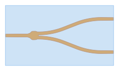
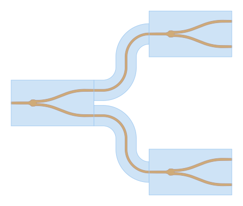

PDK
--------

Every foundry has its process design kit (PDK), which includes technology data, rules & guidelines, primitive components, 
verification files, etc. The designers follow these rules while creating designs for the successful fabrication of their 
structures in that foundry.

Creating a PDK
***************
This section will cover a simple PDK template for ``palgds`` to guide you on the PDK you want to create. Download `sample_pdk` folder 
from the repository and put this folder to your working directory. It is a package which includes `technology.py` and
`components.py` files, and a `gds` folder containing gds files of primitive components.

The `technology.py` file contains the trace templates for optical/electical routes or some layer and dimensional specifications etc. Such as:

.. code-block:: python

    class WaveguideTrace(bc.Trace):
    """Trace template for optical routes"""

    def __init__(self, name, points, bend_radius=5):
        super().__init__(name, points, width=[0.45, 2.45], bend_radius=bend_radius, layer=[0, 1], datatype=[0, 0], port_type='op')
    .
    .
    .
    TECH.LAYER.CORE = (0, 0)
    TECH.DIMENSION.BEND_RADIUS = 5
    
The `components.py` file contains the PCell definitions of primitive foundry cells. Usually, these PCells are created from
provided gds files. Such as:

.. code-block:: python

    import os
    import palgds.base_cells as bc

    gds_path = os.path.join(os.path.dirname(__file__), "gds\\")
    class YBranch(bc.GDSCell):
        """"""
        def __init__(self):
            super().__init__(name="YBranch", filename=gds_path+'YBranch.gds', ports_filename=gds_path+"YBranch.txt")

Using a PDK
*************
In this section, we will use sample PDK in a layout. Import the technology first. Even if you will not use it, importing
technology will change the default parameters such as trace template for circuit routes.

.. code-block:: python

    from sample_pdk import technology
    import sample_pdk.components as cs
    from palgds.circuit import Circuit

Create a YBranch from components of PDK:

.. code-block:: python

    ybranch = cs.YBranch()

Now, let's create a 1x4 splitter using YBranchs:

.. literalinclude:: _tutorial/pdk.py
    :start-at: splitter = Circuit(name='Splitter',
    :end-before: # end of splitter

We see an important thing about importing technology file of the PDK: Even if we did not specify anything in the ``Circuit`` class,
the routes between the components are created with the default waveguide/optical trace of the PDK. Here, default waveguide trace
is composed of 0.45 um wide core layer surrounded by 4.45 um wide cladding layer.